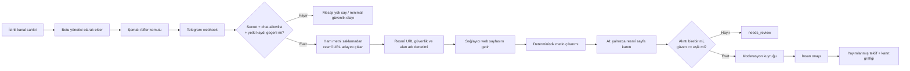

# FreeTierHunt — Telegram Uyumlu ve Sürdürülebilir Veri Toplama Mimarisi

**Tarih:** 14 Ağustos 2026
**Yazar:** Manus AI
**Durum:** Uygulanabilir hedef mimari
**Amaç:** Free tier, deneme, kredi ve indirim fırsatlarını; kaynağı, kanıtı ve kullanım izni denetlenebilir şekilde toplamak, doğrulamak ve yayımlamak.

> Bu belge teknik ve operasyonel tasarım önerisidir. Uygulanabilir gizlilik, telif, tüketici hukuku ve sözleşme yükümlülükleri için faaliyet gösterilecek ülkelerde yetkin hukuk danışmanı incelemesi yapılmalıdır.

## 1. Karar özeti

FreeTierHunt’ın uzun vadeli veri ürünü **Telegram kanal tarayıcısı** olmamalıdır. Doğru ürün, resmî sağlayıcı kaynaklarını merkezine alan; ortakların, topluluk üyelerinin ve Telegram kanallarının yalnızca **izinli aday yönlendirme katmanı** olarak hizmet verdiği bir **fırsat kanıt grafiğidir**.

Telegram’ın koşulları, platformdan elde edilen verinin AI/ML sistemlerini eğitmek, ince ayar yapmak, doğrulamak, geliştirmek, benchmark etmek veya dağıtmak amacıyla kazınmasını, indekslenmesini, toplanmasını ya da kullanılmasını yasaklar. Sınırlı istisna, ilgili kullanıcıların belirli içerik ve belirli sohbet/kanal bağlamı için açık, bilgilendirilmiş, olumlu ve devam eden rıza vermesidir; bu rıza başka bağlamlara taşınamaz.[1] Bu nedenle varsayılan sistem tasarımında **Telegram içeriği model girdisi değildir**. Telegram, sadece yetkili bir kaynak tarafından paylaşılan yapılandırılmış yönlendirmeden sonra resmî web sayfasına geçişi tetikler.

| Katman | Kabul edilen rol | Yasak/kaçınılan rol |
|---|---|---|
| Telegram | İzinli kanalın yapılandırılmış aday yönlendirmesi ve yayın bildirimi | Genel kanal keşfi, geçmiş mesaj toplama, içerik arşivleme, AI için mesaj analizi |
| Resmî sağlayıcı sitesi | Teklif koşullarının birincil doğrulama kaynağı | Kaynağı belirsiz indirim veya kart/ödeme verisi paylaşımı |
| AI modülü | Resmî web sayfasındaki kanıtı yapılandırılmış alanlara dönüştürme | Telegram metnini, kullanıcı profilini veya sosyal sinyalleri sınıflandırma |
| İnsan moderatör | İstisna çözümü, belirsiz kanıt ve yayın kararı | Kanıtsız teklifi “doğrulanmış” olarak yayımlama |

## 2. Tasarım ilkeleri

Mimari altı değişmez ilkeye dayanır. İlk olarak **resmî kaynak önceliği** uygulanır: yayımlanabilir teklif için en az bir resmî sağlayıcı URL’si ve o URL’den alınmış kanıt alıntısı gerekir. İkinci olarak **izin ispatı** uygulanır: bir Telegram kanalı ile entegrasyon, kanal sahibi/yetkili operatör ile kaydedilmiş bir yetki kaydına bağlı olur. Üçüncü olarak **veri minimizasyonu** uygulanır: ham mesaj metni, kullanıcı adı, profil verisi ve medya saklanmaz. Dördüncü olarak **amaç ayrımı** uygulanır: Telegram verisi yönlendirme amacıyla, sağlayıcı sayfası ise doğrulama amacıyla kullanılır. Beşinci olarak **kanıtlanabilir karar** uygulanır: AI çıktısı doğrudan yayın yapmaz; kararın dayandığı resmî URL, alıntı, model sürümü ve inceleme sonucu kayıt altına alınır. Son olarak **geri alınabilirlik** uygulanır: kanal yetkisi, kaynak ve teklif anında askıya alınabilir; geçmiş kanıt ve denetim izi saklanarak yayın kaldırılabilir.

## 3. Kaynak portföyü ve öncelik sırası

Tek bir platforma bağlı veri stratejisi kırılgandır. Ürün, kaynağın güven seviyesi ve kullanım iznine göre çoklu kaynak portföyü işletmelidir.

| Öncelik | Kaynak sınıfı | Örnek erişim biçimi | Yayın öncesi zorunlu kontrol | Otomasyon seviyesi |
|---|---|---|---|---|
| P0 | Resmî sağlayıcı | Fiyatlandırma, program, kredi veya duyuru sayfası; resmî API/RSS | URL alan adı, kanıt alıntısı, güncellik | Yüksek |
| P1 | Yazılı izinli ortak feed | Sağlayıcının verdiği JSON/CSV/RSS veya imzalı API erişimi | Ortak sözleşmesi, şema doğrulama, resmî kanıt | Yüksek |
| P2 | Sağlayıcı/partner gönderimi | Web formu, e-posta doğrulaması, özel yönetim paneli | Gönderen ilişkisi, resmî URL, moderasyon | Orta |
| P3 | İzinli Telegram kanalı | Botun yönetici olduğu kanal, yalnızca `/offer` komutu | Yetki kaydı, allowlist, resmî URL, moderasyon | Düşük–orta |
| P4 | Topluluk bildirimi | Uygulama içi gönderim formu | Resmî URL ve insan incelemesi | Düşük |
| P5 | İnsan araştırması | Küratörün resmî web araştırması | Çift kontrol, kanıt kaydı | Düşük |

Bu sıralamada Telegram, resmî ve partner kaynakların yerine geçmez. En fazla P3 seviyesinde, fırsat adaylarının hızlı fakat kontrollü iletimi için kullanılır. Genel, kapalı veya üçüncü taraf kanallardan mesaj geçmişi alma, kanal haritalama, mesaj indeksleme ya da “popüler fırsat” çıkarımı **kaynak stratejisinin parçası değildir**.

## 4. Kanal yetkilendirme ve onay modeli

Bir Telegram kanalının entegrasyonu teknik karar değil, ayrı bir **kaynak erişim sözleşmesi** olarak ele alınmalıdır. Her kanal için tekil bir `source_access_grant` kaydı bulunur. Kanal sahibi veya yetkili temsilci, hangi kanalın, hangi botun, hangi içerik biçiminin ve hangi işleme amacının geçerli olduğunu açıkça onaylar.

| Alan | Açıklama |
|---|---|
| `source_id` | FreeTierHunt içindeki kaynak kimliği |
| `telegram_chat_id` | Yalnızca izin listesi eşleştirmesi için kanal kimliği |
| `owner_contact` | Kanal sahibi/yetkili temsilci için doğrulanmış iş iletişimi |
| `authorization_basis` | Sözleşme, ortaklık koşulları veya açık rıza kaydı |
| `allowed_content_format` | Sadece yapılandırılmış `/offer` komutu veya onaylı webhook şeması |
| `permitted_purpose` | Aday yönlendirme; ham içerik depolama veya AI işleme değil |
| `valid_from` / `valid_until` | Süreli yetki penceresi |
| `revocation_endpoint` | Kanal sahibinin tek adımda erişimi durdurabileceği yol |
| `audit_artifact_url` | Yetki belgesi veya onay kaydı referansı |

Kanal yetkisi, kullanıcı/aboneden gelen genel bir “gruptayım” beyanıyla oluşturulmamalıdır. Yetkilendirme; kanal sahibiyle doğrulanmış bir iş ilişkisine, hangi botun kanalda yönetici olacağına ve botun yalnızca hangi şemadaki iletileri alacağına dayanmalıdır. Süresi dolmuş, geri alınmış veya belgesi eksik kaynak otomatik olarak `paused` durumuna geçmelidir.

## 5. Uçtan uca veri yaşam döngüsü

Aşağıdaki akış, Telegram verisinin kısıtlı kalmasını ve resmî sayfanın kanıt merkezi olmasını sağlar.



Telegram Bot API, webhook ile HTTPS POST güncellemeleri iletebilir; `allowed_updates` parametresi güncelleme türünün daraltılmasına, `secret_token` ise her istekte gizli başlık ile doğrulama yapılmasına imkân verir.[2] Bu tasarımda üretim webhook’u yalnızca `channel_post` alır. `message`, `edited_channel_post`, medya, üye bilgisi, reaksiyon, özel mesaj ve grup içeriği istenmez.

### 5.1. Kabul edilen Telegram komutu

```text
/offer credit | Product name | Concise headline | https://official-provider.example/offer | Exact proof quote
```

Komut yalnızca geçit görevi görür. `officialUrl` dışında hiçbir alan AI’ya gönderilmez. Başlık, ürün adı ve “proof quote” yalnızca aday kaydı için kullanılabilir; yayımlanmış kanıt, bot komutundaki alıntıdan değil resmî sayfadan yeniden alınan alıntıdan oluşur.

### 5.2. Durum makinesi

| Durum | Giriş koşulu | Sonraki olası durumlar | Saklanan minimum veri |
|---|---|---|---|
| `received` | Secret ve allowlist geçen webhook | `rejected`, `accepted` | Güncelleme kimliği, kanal kimliği, zaman |
| `rejected` | Şema, URL veya yetki kontrolü başarısız | Son | Sebep kodu; ham gövde yok |
| `accepted` | Yapılandırılmış resmî URL bulundu | `fetching` | URL, aday kimliği |
| `fetching` | Resmî URL alınmak üzere | `needs_review`, `analysis_pending` | Fetch metadatası, içerik karması |
| `analysis_pending` | Resmî metin yeterli | `needs_review`, `analysis_succeeded` | Sayfa başlığı, normalleştirilmiş resmî metin |
| `needs_review` | Kanıt zayıf, alıntı uyuşmuyor veya belirsizlik var | `approved`, `rejected` | AI çıktısı, neden, alıntı |
| `approved` | Moderatör resmî kanıtı onayladı | `withdrawn` / `stale` | Teklif sürümü, birincil kanıt |

## 6. AI doğrulama sınırı

AI kullanımı yalnızca Telegram dışındaki resmî sayfa içeriği ile sınırlanır. Modelin değerlendirdiği giriş; sayfa başlığı, normalleştirilmiş sayfa metni ve belirlenmiş maksimum metin penceresidir. Modelden yapılandırılmış JSON beklenir: kategori, teklif türü, karar, güven puanı, resmî sayfadan birebir alıntı, uygunluk, bölge, kart gereksinimi, otomatik yenileme, süre ve inceleme gerekçesi.

| Kontrol | Kural | Sonuç |
|---|---|---|
| Kanıt kaynağı | Teklifteki alıntı resmî sayfa metninde birebir bulunmalı | Uyuşmazsa `needs_review` |
| Güven eşiği | `supported` + en az %80 güven | AI sonucu inceleme önerisi olur; otomatik yayın olmaz |
| Alan adı bağlamı | URL izinli HTTP/HTTPS, dahili/özel ağ değil, sağlayıcı alan adıyla tutarlı | Başarısızsa fetch engellenir |
| Prompt sınırı | Telegram metni, kullanıcı adı, chat kimliği ve profil bilgisi yasak | Veri izolasyonu denetimi |
| Çıktı şeması | Katı JSON şeması; ek alanlar reddedilir | Halüsinasyon yüzeyi azalır |
| Yayın kararı | İnsan moderatör, resmî alıntı ve koşulları inceler | Hesap verebilirlik korunur |

Bu düzen, AI’nın “fırsat bulan” değil, **resmî kanıtı yapılandıran ve belirsizliği yükselten** bir yardımcı olmasını sağlar. AI çıktısı, kaynak gerçeğinin yerini tutmaz.

## 7. Güvenlik ve gizlilik kontrolleri

### 7.1. Webhook katmanı

Webhook, yalnızca HTTPS üzerinden çalışmalı; Telegram’ın `X-Telegram-Bot-Api-Secret-Token` başlığı sabit-zamanlı karşılaştırma ile doğrulanmalıdır. `allowed_updates` sadece `channel_post` ile sınırlandırılmalı, `update_id` benzersiz anahtar olarak kaydedilmeli ve tekrarlanan teslimatlar yeni aday üretmemelidir. Bot token ve webhook secret yalnızca sunucu tarafı gizli değişkenlerde tutulmalı; istemciye veya günlük kayıtlarına girmemelidir.[2]

### 7.2. URL ve ağ güvenliği

Aday URL’si getirilmeden önce protokol, kullanıcı/parola bilgisi, localhost, özel IP aralıkları, DNS yeniden çözümleme ve yönlendirme hedefi kontrol edilmelidir. Başlangıç URL’sinin güvenli olması yeterli değildir; her HTTP yönlendirmesindeki hedef de aynı SSRF politikasından geçmelidir. Yanıt gövdesi boyutu, zaman aşımı, içerik türü ve yönlendirme sayısı sınırlanmalıdır.

### 7.3. Veri minimizasyonu ve saklama

| Veri türü | Saklama politikası | Gerekçe |
|---|---|---|
| Ham Telegram mesaj gövdesi | Saklanmaz; işlem sırasında bellekten sonra silinir | Telegram içeriğinin amaç dışı kullanımını engellemek |
| Kullanıcı adı, profil, üye listesi | Toplanmaz | Aday yönlendirmesi için gerekli değildir |
| Kanal kimliği | Yetki allowlist’i ve denetim için saklanır | Erişim kontrolü ve olay araştırması |
| Webhook `update_id` | 90 gün, sonra özet denetim kaydı | İdempotency ve teslim sorunları |
| Resmî sayfa metni | Kanıt sürümüne bağlı sınırlı süre; karma + alıntı kalıcı | Teklif doğrulaması ve yeniden üretilebilirlik |
| AI çıktı ve maliyet kaydı | Teklif yaşam döngüsü + denetim süresi | Karar izlenebilirliği |
| Yetki belgesi | Yetki süresi + sözleşme saklama yükümlülüğü | Kaynak erişim hakkının ispatı |

Süreler, veri sorumlusu ve ilgili yerel mevzuatla belirlenmelidir. Uygulama, kaynak sahibinin erişimi geri çekebilmesi için yetki kaydını derhal `paused` yapmalı; yeni webhook güncellemelerini reddetmeli; varsa işlenmemiş adayları iptal etmelidir.

## 8. Operasyon modeli ve sorumluluk matrisi

| Rol | Sorumluluk | Yetki |
|---|---|---|
| Kaynak ortağı / kanal sahibi | Yetki vermek, yapılandırılmış aday paylaşmak, erişimi geri çekmek | Kendi kaynak kaydını başlatma/durdurma |
| FreeTierHunt kaynak yöneticisi | Yetki belgesini doğrulamak, kaynak health izlemesi | Allowlist açma, duraklatma |
| Moderatör | Resmî kanıtı incelemek, teklif yayımlamak veya reddetmek | Teklif yayını; kanal yetkisi değiştiremez |
| Güvenlik sorumlusu | Secret rotasyonu, olay yanıtı, erişim gözden geçirme | Webhook kapatma, olay erişimi |
| AI operasyon sorumlusu | Prompt/şema sürümü, kalite eşiği, maliyet limiti | Model ayarı; yayın kararı veremez |

Her kaynak için aylık erişim gözden geçirmesi yapılmalıdır. Ölçümler: geçerli yetki oranı, webhook red oranı, resmî URL fetch başarı oranı, AI `needs_review` oranı, insan onay/red oranı, stale teklif oranı, kaynak geri çekme süresi ve LLM maliyeti.

## 9. Olay yanıtı ve geri alma

| Olay | Anlık işlem | 24 saat içi işlem | Kalıcı düzeltme |
|---|---|---|---|
| Geçersiz secret veya şüpheli webhook trafiği | IP/olay telemetrisi, isteği reddet | Secret rotasyonu, webhook bilgisi kontrolü | Secret yönetimi ve saldırı eşiği güncellemesi |
| Yetkisiz kanal mesajı | Aday oluşturma; yok say | Kanal kimliği ve allowlist denetimi | Yetki kaydı doğrulama kuralı |
| Yanlış/eskimiş teklif | Yayından kaldırma veya `stale` | Resmî URL yeniden doğrulama | Daha kısa reverify aralığı veya kaynak düşürme |
| AI alıntı uyumsuzluğu | `needs_review` | Model çıktısı/prompt sürümü incelemesi | Şema, eşik veya model güncellemesi |
| Kaynak sahibinin erişim geri çekmesi | Kaynağı `paused`, webhook kabulünü kes | İşlenmemiş adayları iptal | Yetki geri alma SLA’sı ve denetim kaydı |

## 10. Uygulama yol haritası

### Aşama 0 — Politika ve ortaklık temeli (1–2 hafta)

Kaynak yetki sözleşmesi, gizlilik bildirimi, kanal onboarding formu, veri saklama tablosu ve geri alma prosedürü hazırlanır. Bu aşama tamamlanmadan yeni kanal entegrasyonu açılmaz.

### Aşama 1 — Uyumlu Telegram gateway (1 hafta)

Mevcut webhook’a `source_access_grants` doğrulaması, son geçerlilik tarihi, kaynak durumu, secret rotasyon zamanı ve kanal başına hız limiti eklenir. `allowed_updates` yalnızca `channel_post` olarak sabitlenir. Ham mesaj gövdesi için saklama/loglama denetimi eklenir.

### Aşama 2 — Resmî URL güvenlik geçidi (1 hafta)

SSRF kontrolü her yönlendirme adımına taşınır; alan adı allowlist/denylist kuralları, DNS çözümleme kontrolü, yanıt boyutu limiti ve içerik türü filtresi eklenir. Başarısız fetch, eski kanıtı silmeden `needs_review` üretir.

### Aşama 3 — Kanıt ve AI kalite kapıları (1–2 hafta)

Resmî sayfa gözlemi, içerik karması, model/prompt sürümü, yapılandırılmış sonuç ve alıntı eşleştirmesi kaydedilir. AI başarısı otomatik yayın yerine moderatör önerisi olarak kalır. LLM maliyet kaydı aylık bütçe korumasına gerçekten bağlanır.

### Aşama 4 — Partner feed’leri ve Telegram’sız ölçek (2–4 hafta)

Öncelik, resmî RSS/API/partner feed adapter’larına verilir. Telegram kanalı, başlıca kaynak değil, ortaklar için opsiyonel hızlı giriş yolu olur. Bu değişim, tek platform bağımlılığını azaltır.

### Aşama 5 — Denetim ve olgunluk (sürekli)

Aylık erişim gözden geçirmesi, üç aylık veri saklama denetimi, kaynak kalitesi raporu, prompt regresyon seti, incident drill ve kanal yetkisi yenileme işletilir.

## 11. Uygulama öncelik tablosu

| Öncelik | İş paketi | Başarı ölçütü |
|---|---|---|
| P0 | `source_access_grants` ve yetki geri alma | Yetkisiz/süresi geçmiş kanaldan sıfır aday |
| P0 | Yönlendirme sonrası SSRF koruması | Özel ağ veya riskli redirect hedefinin sıfır fetch’i |
| P0 | Ham mesaj log redaksiyonu | Log ve DB taramasında ham mesaj gövdesi yok |
| P1 | Resmî kanıt alıntısı kalite kapısı | Alıntı uyuşmazlığında %100 `needs_review` |
| P1 | Gerçek LLM maliyet muhasebesi | Aylık limit aşıldığında otomatik durdurma |
| P1 | Kaynak health ve yeniden doğrulama | Değişen sayfada teklifin stale işaretlenmesi |
| P2 | Partner feed adapter’ları | Tekliflerin çoğunluğunun P0/P1 kaynaklardan gelmesi |
| P2 | Kaynak sahibi portalı | Yetki güncellemesi ve geri alma işleminin self-service yapılması |

## 12. Sonuç

Sürdürülebilir yaklaşım “Telegram’dan veri çekmek” değil, **izinli kaynaklardan resmî kanıta yönlendirilmiş aday almak**tır. Telegram entegrasyonu; dar webhook türü, doğrulanmış kanal yetkisi, minimal veri saklama ve yayımlama öncesi resmî web kanıtı ile sınırlı tutulursa ürüne hız kazandırır. Ölçek, Telegram mesajlarını çoğaltarak değil; resmî API/RSS, sağlayıcı ortaklıkları, yapılandırılmış gönderimler ve yeniden doğrulanabilir kanıt grafiği geliştirerek elde edilir.

## Kaynakça

[1] [Telegram — Terms of Service for Content Licensing](https://telegram.org/tos/content-licensing)
[2] [Telegram Bot API — Updates and webhooks](https://core.telegram.org/bots/api)
[3] [Telegram API Terms of Service](https://core.telegram.org/api/terms)
