# Telegram Dışı Fırsat Keşif Kaynakları: RSS, Web, API ve Partner Feed Entegrasyon Planı

**Tarih:** 17 Ağustos 2026  
**Durum:** Mimari ve önceliklendirilmiş uygulama planı  
**Kapsam:** FreeTierHunt’ın resmî kaynaklardan fırsat adaylarını otomatik bulma yeteneğini genişletmek.

## Amaç ve ilke

FreeTierHunt’ın keşif motoru, fırsatları yalnız gönderim formundan veya Telegram’dan beklemez. Sistem, resmî sağlayıcı sayfalarını, resmî RSS/Atom duyurularını, belgelendirilmiş API’leri ve yazılı izinli partner feed’lerini düzenli olarak izler. Her kaynak, yalnızca **aday üretir**; yayımlanabilir teklif olmak için resmî URL kanıtı, doğrulama ve insan moderasyonu gerekir.

> **Kaynak türü, güven seviyesi değildir.** Bir RSS öğesi veya partner feed’i bir fırsatı haber verebilir; ancak kullanıcıya görünen iddia, mümkün olduğunda teklifin kendi resmî sağlayıcı sayfasındaki kanıtla desteklenir.

| Kaynak sınıfı | Örnek | Sağladığı sinyal | Kullanım sınırı |
|---|---|---|---|
| Resmî web program sayfası | AWS Activate, Google Cloud Startup, Cloudflare for Startups | Değer, uygunluk, süre ve başvuru bağlantısı | Mevcut HTTP adapterı + içerik değişikliği |
| Resmî RSS/Atom | Sağlayıcı ürün/blog/duyuru akışı | Yeni kampanya, free-tier değişikliği, kredi/partner duyurusu | Sadece resmî feed veya resmî alan adı |
| Resmî JSON/REST/GraphQL API | Sağlayıcının program, katalog veya duyuru API’si | Yapılandırılmış kampanya/ürün/veri alanları | Kimlik doğrulama, kota ve izin kapsamı kayıtlı olmalı |
| Resmî katalog sayfası | GitHub Student Developer Pack | Bir kaynaktaki çoklu partner teklif sinyali | Partner kartı, her hedef teklif için tekrar kanıtlanır |
| İzinli partner feed’i | Accelerator veya VC portföy avantaj kataloğu | Program üyelerine özel avantaj/duyuru | Yazılı izin, HMAC/API anahtarı ve şema sözleşmesi |
| Topluluk sinyali | Uygulama içi gönderim | Aday URL | En düşük öncelik; resmî URL olmadan yayın yok |

GitHub Student Developer Pack, tek bir resmî sayfada çok sayıda partner teklifini kataloglar; bu nedenle katalog adapterı için anlamlı bir P1 kaynaktır.[1] Google Cloud, AWS ve Cloudflare startup programları ise resmî kredi/uygunluk sinyalleri içerdiği için P0 web kaynaklarıdır.[2] [3] [4]

## Ortak adapter sözleşmesi

Mevcut `SourceAdapter` sözleşmesi tek bir HTML belge döndürüyor. RSS/API/katalog desteği için bu sözleşme **belge listesi** ve **kaynak cursor’ı** kavramıyla genişletilmelidir.

```ts
type SourceDocument = {
  externalId: string;          // RSS guid, API id veya canonical URL hash
  canonicalUrl: string;
  title: string | null;
  publishedAt: Date | null;
  body: string | null;
  contentHash: string;
  metadata: Record<string, unknown>;
};

type DiscoveryAdapter = {
  key: string;
  kind: 'official_html' | 'rss_atom' | 'official_api' | 'partner_json' | 'catalog_html';
  fetch(source: SourceRecord, cursor: SourceCursor): Promise<FetchBatch>;
  normalize(batch: FetchBatch): SourceDocument[];
  discover(source: SourceRecord, document: SourceDocument): DiscoveryCandidateDraft[];
};
```

Bu tasarımda `source_observations.external_id`, RSS öğesinin `guid` değeri veya API kaynağının kararlı kimliği için kullanılır. Aynı öğe ikinci kez gelirse `source_id + external_id + content_hash` eşleşmesi yeni aday üretimini engeller. `source_fetch_runs`, HTTP/API isteğinin sağlık ve kota sonucunu saklar; `discovery_candidates`, normalize edilmiş fırsat adayını moderasyon öncesinde tutar.

## Kaynak bazlı entegrasyon desenleri

### 1. Resmî web değişiklik takibi

Bu katman zaten ilk biçimiyle mevcuttur. Her resmî sayfa için ETag, Last-Modified ve içerik karması izlenir. Sayfa değiştiğinde sağlayıcı profili, açıkça görünen kredi tutarı, deneme süresi, free-tier kota, uygunluk veya fiyat indirimi metnini aday olarak çıkarır. Uygun profil yoksa gözlem saklanır ancak aday üretilmez.

İlk genişleme, `official-program-profiles.ts` içindeki üç sağlayıcı profilini; Supabase, Vercel, Render, DigitalOcean, GitHub Education ve resmî AI/API program sayfalarına genişletmektir. Her yeni profil için gerçek resmî içerik fixture’ı, negatif örnek ve fingerprint testi zorunlu tutulur.

### 2. RSS/Atom adapterı

RSS/Atom adapterı, sıralı duyuru kaynağı için en düşük maliyetli keşif yoludur. Feed URL’si kaynak olarak eklenir; adapter `If-None-Match` ve `If-Modified-Since` ile çekim yapar, XML’i güvenli biçimde parse eder ve her item için `guid`/`id`, `link`, başlık, yayın tarihi ve açıklama çıkarır.

| Kontrol | RSS/Atom kuralı |
|---|---|
| Kararlı kimlik | Önce `guid`/Atom `id`, yoksa canonical URL + başlık + tarih karması |
| Resmî hedef | Feed alan adı veya item hedef URL’si kaynak allowlist’iyle uyumlu olmalı |
| İçerik | Açıklama yalnız aday sinyalidir; iddia için hedef resmî sayfa tekrar alınır |
| Yenileme | ETag/Last-Modified; yoksa item kimlikleri ve content hash |
| Sıklık | Feed başına 60–360 dakika; `Retry-After` ve HTTP 429 önceliklidir |
| Başarısızlık | Üç ardışık hatada `degraded`; son başarılı item’lar korunur |

RSS adapterı önce sağlayıcıların resmî ürün, changelog veya startup duyuru feed’leriyle devreye alınır. Genel teknoloji haber feed’leri yalnız “research signal” olarak tutulur; iddia üreten birincil kaynak yapılmaz.

### 3. Resmî API adapterı

Bazı sağlayıcılar teklif/katalog/duyuru verisini API ile daha kararlı biçimde sunar. Bu adapter, API anahtarını kaynak kaydında değil sunucu gizli yapılandırmasında tutar. Kaynak kaydı yalnız `credential_reference`, izin kapsamı, endpoint alan adı, kota ve adapter sürümü referansını içerir.

API adapterı, sayfalama cursor’ı, yanıt şeması sürümü, `Retry-After`, 429/5xx backoff ve kaynak bazlı günlük istek bütçesi uygular. API yanıtında resmî claim URL yoksa aday `needs_review` niteliğiyle düşük öncelikli üretilir veya yalnız research sinyali olarak kaydedilir.

### 4. Resmî katalog adapterı

GitHub Student Developer Pack gibi kataloglar, yüzlerce farklı partneri tek resmî kaynaktan duyurabilir.[1] Katalog adapterı kart/bağlantı listesini çıkarır; her satır için partner adı, ana başlık, katalog kanıtı ve varsa resmî hedef URL kaydeder. Bu adım bir fırsatı yayınlamaz. Hedef URL sağlayıcının resmî alan adına doğrulanana kadar adayın güven seviyesi düşük kalır.

### 5. İzinli partner JSON/CSV feed’i

Accelerator, VC, üniversite veya topluluk ortağı kendine ait avantaj kataloğunu paylaşmak isterse JSON veya CSV feed’i kullanılır. Feed için yazılı izin, sahip iletişimi, veri şeması sürümü ve iptal/revocation kaydı zorunludur. JSON feed’inde HMAC imzası veya kısa ömürlü OAuth token; CSV’de HTTPS, IP allowlist ve imzalı indirme URL’si tercih edilir.

Partner feed’i en az şu alanları sağlamalıdır: `external_id`, `provider_name`, `headline`, `official_url`, `offer_type`, `last_updated_at`. `official_url` sunucu tarafında tekrar çekilir ve kanıt zincirinin birincil halkası olur.

## Normalleştirme ve güven zinciri

```mermaid
flowchart LR
    A[Resmî Web / RSS / API / Partner Feed] --> B[Adapter fetch + cursor]
    B --> C[Source observation]
    C --> D[Deterministik aday çıkarımı]
    D --> E[Fingerprint + deduplikasyon]
    E --> F[Discovery candidate]
    F --> G[Resmî claim URL fetch]
    G --> H[AI ile yalnız resmî kanıt analizi]
    H --> I[İnsan moderasyonu]
    I --> J[Yayınlanmış teklif]
```



Her adapter sonucu bu ortak kurallardan geçer:

| Aşama | Zorunlu kontrol |
|---|---|
| URL | HTTPS, SSRF koruması, yönlendirme sonrası alan adı denetimi |
| Kaynak | `active` durum, izin/kota, adapter türü ve alan adı allowlist’i |
| Tekilleştirme | Kaynak + external ID/canonical URL + teklif türü + normalize başlık fingerprint’i |
| Kanıt | Aday alıntısı gözlem metninde birebir bulunmalı |
| Doğrulama | AI yalnız resmî sağlayıcı URL’sinden alınmış metni analiz eder |
| Yayın | İnsan onayı; otomatik `active` teklif oluşturulmaz |

## Aşamalı uygulama sırası

| Aşama | Teslim | Başarı ölçütü |
|---|---|---|
| P0 | Web profil portföyünü 3’ten 10 resmî kaynağa çıkarma | Her profil için fixture, negatif test, kaynak sağlık kaydı |
| P0 | `adapter_kind`, `cursor` ve item bazlı external ID desteği | Değişmeyen kaynakta sıfır yeni aday |
| P1 | RSS/Atom adapterı ve ilk 5 resmî feed | GUID tabanlı idempotency, 429/backoff testi |
| P1 | Katalog adapterı: GitHub Student Pack | Partner kartı → resmî hedef URL adayı; yinelenme oranı ölçümü |
| P1 | Partner JSON feed’i | Şema doğrulama, imza/token, revocation ve kota kaydı |
| P2 | Resmî API adapterları | Sayfalama, quota, credential reference ve health dashboard |
| P2 | Kaynak kalite skoru | Aday→doğrulama→yayın dönüşümü, stale oranı, hata oranı |

## Çalıştırma seçenekleri

Otomatik tarama deterministik ve zamanlanmış bir arka plan işidir. İki uygulanabilir çalışma yaklaşımı vardır; kaynak sayısı ve istenen yönetim düzeyi seçimi belirlemelidir.

| Yaklaşım | Nasıl çalışır | Ödünleşimler | Maliyet | Kurulum karmaşıklığı |
|---|---|---|---|---|
| Yönetilen uygulama içi periyodik işler | Uygulama arka planda belirli aralıklarla RSS/API/web adapterlarını çağırır; yönetim ekranı kaynakları ve aralıkları yönetir | Başlangıç kolaydır; uzun veya çok yoğun crawl işlerinde çalışma süresi/kaynak sınırı izlenmelidir | Başlangıçta düşük; kullandığınız barındırmaya bağlı | Düşük–orta |
| Ayrı sürekli worker | Mevcut PM2 worker gibi tek bir sürekli süreç, kaynak aralıklarını izler ve adapterları sırayla yürütür | Daha fazla operasyon sorumluluğu; yüksek frekans, özel bağımlılık ve daha büyük kaynak portföyü için uygundur | Sunucu maliyetine bağlı | Orta |

## Kaynaklar

[1] [GitHub Education — Student Developer Pack](https://education.github.com/pack)  
[2] [Google Cloud — Google for Startups Cloud Program](https://cloud.google.com/startup)  
[3] [AWS — Activate Credits](https://aws.amazon.com/startups/credits/)  
[4] [Cloudflare — Cloudflare for Startups](https://www.cloudflare.com/startups/)
